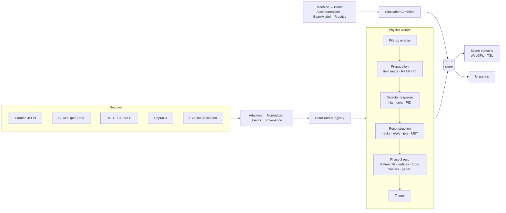

<div align="center">

# ⚛️ LHC Simulator

### A scientifically grounded, interactive 3D Large Hadron Collider — in your browser

*Make invisible physics understandable without pretending it is visible.*


**City → Ring → Tunnel → Interaction Region → Cavern → Detector → Collision event**
<br/>
Real CERN Open Data · PYTHIA 8 · field maps · Kalman track fitting · quench physics · honest visualization

</div>

---

## Table of contents

- [Why this project](#-why-this-project)
- [Highlights](#-highlights)
- [Quick start](#-quick-start)
- [A guided tour](#-a-guided-tour)
- [Data sources](#-data-sources)
- [Physics & engineering theory](#-physics--engineering-theory)
- [Scientific honesty](#-scientific-honesty)
- [Architecture](#-architecture)
- [Project structure](#-project-structure)
- [Testing & validation](#-testing--validation)
- [Performance](#-performance)
- [Known limitations](#-known-limitations)
- [Roadmap](#-roadmap)
- [Documentation](#-documentation)
- [Sources & credits](#-sources--credits)

---

## 🎯 Why this project

Most LHC visualizations show glowing beams, fireworks at the collision point and particles as
colored lasers. None of that is what really happens: the beams are invisible, a collision lasts
about 50 ns, and what the detectors record is hits and energy deposits, not "tracks".

This simulator takes the opposite approach. It computes the physics first (magnetic rigidity,
beam optics, luminosity, particle propagation in magnetic fields, detector response and
reconstruction), then shows the result. **Every visual element states what it is.** Physical
hardware, detector measurements, simulation truth, reconstructed data, analysis constructs and
cinematic enhancement are kept separate. Recorded collision data is never shown as simulation
truth.

It is an educational laboratory, **not** Geant4, the experiments' software, MAD-X or a digital
twin. Every approximation is documented.

---

## ✨ Highlights

<table>
<tr>
<td width="50%" valign="top">

### 🏙️ Multi-scale world
- Seven scene domains, each with its own origin, scale, camera and GPU resources
- Geneva basin → 26.7 km ring → arc tunnel with a true 2804 m bending radius
- Interaction-region optics scene (±80 m around the IP)
- Four explorable experiments: **ATLAS**, **CMS**, **ALICE**, **LHCb**

### 🧲 Accelerator physics
- Magnetic rigidity for protons and ions (Pb, Xe, Ne, O)
- Synchrotron radiation, magnet margin, machine presets (LHC, HL-LHC, FCC-hh, Sandbox)
- FODO optics and periodic Twiss parameters
- IR optics with **β\***, **crossing angle**, **Piwinski factor** and long-range beam separation
- **Quench V2**: thermal/electrical model with minimum quench energy, normal-zone propagation and protection

</td>
<td width="50%" valign="top">

### 💥 Events & detectors
- **Real CMS collision data** from CERN Open Data (Z, J/ψ, Υ, W, dimuon spectra)
- **PYTHIA 8** generation with reproducible seeds, via a local backend
- ROOT files through **JSROOT** (CMS NanoAOD, ATLAS 13 TeV Open Data), plus HepMC3 import
- Luminosity → event rates, Poisson **pile-up**, educational **trigger**
- Interpolated **field maps** and an adaptive Dormand–Prince integrator
- Particle ID: TPC dE/dx, time of flight, RICH Cherenkov angle

### 🔬 Reconstruction & analysis
- Kalman-like **track fit** with seed, fit, ±1σ, residuals and uncertainty evolution
- Primary, pile-up and displaced vertices (K⁰_S / Λ tags)
- Topological clustering, **generalized-kT jets** (anti-kT / C/A / kT), MET
- Binned likelihood **fits** (Gaussian, signal + background), JSROOT plots

</td>
</tr>
</table>

---

## 🚀 Quick start

**Requirements:** Node.js 20+ (developed on Node 22), and a browser with WebGPU. Chrome or Edge
is recommended; other browsers fall back automatically to WebGL 2.

```bash
git clone https://github.com/EarthStrixDEV/LHC_Sim.git
```

```bash
cd LHC_Sim
```

```bash
npm install
```

```bash
npm run dev
```

Open the printed URL (default `http://localhost:5173`).

> 💡 Add `?renderer=webgl` to the URL to force the WebGL 2 fallback, for example on a problematic GPU driver.

### Commands

| Command | What it does |
|---|---|
| `npm run dev` | Dev server. It also relays CERN Open Data downloads and the PYTHIA backend through proxies |
| `npm run build` | Type-check and production build into `dist/` |
| `npm run preview` | Serve the production build |
| `npm run typecheck` | `tsc --noEmit` |
| `npm test` | Run the full Vitest suite |
| `npm run generate:events` | Regenerate the curated synthetic samples (deterministic) |
| `npm run fetch:cern -- --list` | List the CERN Open Data files the adapters understand |
| `npm run fetch:cern -- <id> --max N` | Download and preprocess one dataset into `public/datasets/` |

### Optional: PYTHIA 8 backend

Requires Python ≥ 3.9. PYTHIA runs in its own process, so the 3D view never waits for it.

```bash
pip install pythia8mc
```

```bash
python server/pythia_server.py
```

Then open **Data → Event generator**. Choose a process, √s, event count and seed, and press
*Generate*. The same seed always gives the same events.

---

## 🧭 A guided tour

| Where | Try this |
|---|---|
| **Left panel** | Switch machine (LHC / HL-LHC / FCC-hh / Sandbox), species and energy. Watch the rigidity, required dipole field and warnings update live |
| **Honesty modes** (top bar) | Compare **PHYSICAL** (what an eye could see), **DETECTOR** (what is recorded), **AUGMENTED** (invisible quantities made visible), **ANALYSIS** (reconstructed objects), **CINEMATIC** |
| **Physics tab** | FODO β-functions, magnet state, **Quench V2**: set a disturbance energy, turn heaters or energy extraction on and off, and watch current, hot-spot temperature and energy evolve |
| **Collider tab** | Luminosity vs cross section vs rate vs yield, the bunch filling scheme, pile-up P(n; μ), trigger decisions and rates, IR optics (β\*, crossing angle, TFS import) |
| **IR Optics scene** | Two beam envelopes squeezed to the IP waist, crossing at an angle (drawn ×1000, and labelled so) |
| **Detector tab / scene** | Choose ATLAS, CMS, ALICE or LHCb, toggle subsystems, read each model's fidelity level, degrade the detector response (dead/noisy channels, worse resolution) |
| **Event tab / scene** | Browse events, click a trajectory, compare **truth vs hits vs fitted track**, inspect vertices and jets, switch jet algorithm and radius, look at PID plots |
| **Histogram** | Accumulate the invariant mass over a dataset, fit a peak, toggle the JSROOT view, export a TH1D, or load a TH1 from a `.root` file |
| **Data tab** | Download real CMS data, open preprocessed datasets, import JSON / CSV / HepMC3 / ROOT files, generate PYTHIA events |

> 🧪 **Recipe: rediscover the Z boson in real data.** In **Data**, download *CMS 2011 Z → μμ candidates*.
> In **Event**, press *All events* under the histogram, choose *Gaussian + linear background* and *Fit*.
> The peak sits near 91 GeV, and the dataset is labelled **RECORDED COLLISION DATA**.

---

## 🗂️ Data sources

Everything enters through an adapter that produces a single **normalized event model**
(`lhcsim-normalized/1`). Each event carries its **provenance** (source, experiment, year, √s,
license, DOI, generator and seed, processing notes) and a **data level**.

| Source | Adapter | Data level | Notes |
|---|---|---|---|
| Curated toy samples | `curated/CuratedAdapter` | Simulated truth | Z→μμ, H→γγ, Z→ee, multijet, tt̄, Pb–Pb |
| PYTHIA 8 | `generators/PythiaRecord` | Simulated truth | Minimum bias, Drell–Yan, gg→H→γγ, QCD jets, tt̄; deterministic seeds |
| CERN Open Data | `cern/CERNOpenDataAdapter` | **Recorded collision data** | CMS outreach CSV, records [545](https://opendata.cern.ch/record/545) and [700](http://opendata.cern.ch/record/700) (CC0) |
| ROOT files | `root/ROOTAdapter` + JSROOT | As declared at import | CMS NanoAOD `Events`, ATLAS 13 TeV Open Data `mini` |
| HepMC3 ASCII | `hepmc/HepMCAdapter` | Simulated truth | Units, implicit vertices and PDG charges handled |
| ROOT-converted / normalized JSON | `ImportService` | From provenance | For server-side preprocessing (e.g. uproot) |

**Hard rules**, enforced by validation and tests:

- Recorded data **can never carry generator truth**.
- Adapters **never manufacture** missing truth, hits or calorimeter cells.
- Large files are fetched only on **explicit user action**, streamed, and capped at an event limit.

See [docs/data-sources.md](docs/data-sources.md) for details.

---

## 📐 Physics & engineering theory

This section summarizes the physics and engineering models the simulator implements, with the
equations used in the code. Units: SI internally; energies, momenta and masses in GeV with c = 1
unless stated; κ = 0.299 792 458 GeV·T⁻¹·m⁻¹. Each topic names the module that implements it.
Click a topic to expand it.

### 1 · Relativistic kinematics

<sub>Implemented in <code>physics/events/FourVector.ts</code></sub>

```math
E^2 = p^2 + m^2,\qquad \beta = \frac{p}{E},\qquad \gamma = \frac{E}{m},\qquad \beta\gamma = \frac{p}{m}
```

Collider coordinates (beam along *z*):

```math
p_T = \sqrt{p_x^2+p_y^2},\qquad
\eta = -\ln\tan\frac{\theta}{2} = \operatorname{asinh}\frac{p_z}{p_T},\qquad
y = \frac12\ln\frac{E+p_z}{E-p_z},\qquad
\phi = \operatorname{atan2}(p_y,p_x)
```

The invariant mass of a system is what reveals resonances (Z, H, J/ψ, K⁰_S …):

```math
m^2 = \Big(\sum_i E_i\Big)^2 - \Big|\sum_i \vec p_i\Big|^2
\;\xrightarrow{\;m_i\,\ll\,p\;}\;
m_{12}^2 \simeq 2\,p_{T1}\,p_{T2}\,\big(\cosh\Delta\eta - \cos\Delta\phi\big)
```

Centre-of-mass energy for identical head-on beams: $`\sqrt{s}=2E_\text{beam}`$. For ions, per nucleon pair:
$`\sqrt{s_{NN}} = 2E_\text{beam}/A`$, with $`E_\text{beam} = Z\cdot E_\text{p-equiv}`$ at fixed rigidity.


### 2 · Magnetic rigidity & ring kinematics

<sub>Implemented in <code>physics/accelerator/MagneticRigidity.ts</code>, <code>AcceleratorCore.ts</code></sub>

A particle of charge *Ze* on a circle of radius ρ in a field *B*:

```math
B\rho = \frac{p}{Ze}\quad\Longrightarrow\quad p\,[\text{GeV}] = 0.2998\;|Z|\;B\,[\text{T}]\;\rho\,[\text{m}]
```

Example: LHC dipoles at 8.33 T with ρ = 2803.95 m give p ≈ 7 TeV for protons.
Revolution frequency, beam current and stored energy:

```math
f_\text{rev} = \frac{\beta c}{C},\qquad
I_\text{beam} = n_b\,N\,Z e\,f_\text{rev},\qquad
E_\text{stored} = n_b\,N\,E
```


### 3 · Synchrotron radiation

<sub>Implemented in <code>physics/accelerator/SynchrotronRadiation.ts</code></sub>

Energy lost per turn in an isomagnetic ring, with its critical photon energy:

```math
U_0 = \frac{Z^2 e^2\,\beta^3\gamma^4}{3\,\varepsilon_0\,\rho},\qquad
\varepsilon_c = \frac{3}{2}\,\frac{\hbar c\,\gamma^3}{\rho},\qquad
P_\text{SR} = U_0\, f_\text{rev}\, n_b N
```

The γ⁴ = (E/m)⁴ scaling is why electrons radiate ≈ (m_p/m_e)⁴ ≈ 10¹³ times more than protons
at the same energy. The Sandbox therefore flags a 7 TeV electron ring as non-physical.


### 4 · Superconducting magnets & the critical surface

<sub>Implemented in <code>physics/accelerator/MagnetModel.ts</code></sub>

Upper critical field vs temperature, and the operating margin on the load line:

```math
B_{c2}(T) = B_{c20}\left[1-\left(\frac{T}{T_{c0}}\right)^{1.7}\right],\qquad
\text{margin} = 1 - \frac{B_\text{op}}{B_\text{ss}(T)}
```

The short-sample field $`B_\text{ss}`$ is scaled from one reference point of each magnet. Critical
temperature at a given field (Nb-Ti fit) and magnetic energy:

```math
T_c(B) = T_{c0}\left(1-\frac{B}{B_{c20}}\right)^{0.59},\qquad
E_\text{mag} = \tfrac12 L I^2
```

| | T_c0 | B_c20 |
|---|---|---|
| Nb-Ti | 9.2 K | 14.5 T |
| Nb₃Sn | 18 K | 28 T (VERIFY) |


### 5 · Linear beam optics (Courant–Snyder / Twiss)

<sub>Implemented in <code>physics/beam/*</code>, <code>physics/optics/*</code></sub>

Transverse motion obeys Hill's equation, with quadrupole strength $`k = G/(B\rho)`$:

```math
x''(s) + K(s)\,x(s) = 0
```

Its solution is the betatron oscillation:

```math
x(s) = \sqrt{\varepsilon\,\beta(s)}\,\cos\big(\psi(s)+\psi_0\big),\qquad \psi' = \frac{1}{\beta}
```

Transfer matrices ($`\sqrt{k}L=\varphi`$; *k* < 0 gives cosh/sinh, i.e. defocusing):

```math
M_\text{drift}=\begin{pmatrix}1&L\\0&1\end{pmatrix},\qquad
M_\text{QF}=\begin{pmatrix}\cos\varphi & \dfrac{\sin\varphi}{\sqrt k}\\[4pt] -\sqrt k\sin\varphi & \cos\varphi\end{pmatrix}
```

Periodic (matched) solution of a cell with one-period matrix *M*. It is stable only if |cos μ| < 1:

```math
\cos\mu = \tfrac12\operatorname{Tr}M,\qquad
\beta = \frac{m_{12}}{\sin\mu},\qquad
\alpha = \frac{m_{11}-m_{22}}{2\sin\mu},\qquad
\gamma = \frac{1+\alpha^2}{\beta}
```

Transport of the Twiss parameters through *M*, which preserves βγ − α² = 1:

```math
\begin{pmatrix}\beta\\ \alpha\\ \gamma\end{pmatrix}_{2}=
\begin{pmatrix} m_{11}^2 & -2m_{11}m_{12} & m_{12}^2\\
-m_{11}m_{21} & m_{11}m_{22}+m_{12}m_{21} & -m_{12}m_{22}\\
m_{21}^2 & -2m_{21}m_{22} & m_{22}^2\end{pmatrix}
\begin{pmatrix}\beta\\ \alpha\\ \gamma\end{pmatrix}_{1}
```

Beam size and emittance. The normalized emittance is invariant under acceleration, so the beam
shrinks as it gains energy (adiabatic damping):

```math
\sigma = \sqrt{\varepsilon\,\beta},\qquad \varepsilon = \frac{\varepsilon_n}{\beta_r\gamma_r}
```

At the interaction point (a waist, α* = 0):

```math
\beta(s) = \beta^* + \frac{s^2}{\beta^*}
```

A smaller β* gives a smaller σ*, but a larger β in the inner triplet. That is the squeeze trade-off
limited by magnet aperture.


### 6 · Luminosity, crossing angle, rates & pile-up

<sub>Implemented in <code>physics/beam/BeamModel.ts</code>, <code>physics/luminosity</code>, <code>physics/bunches</code>, <code>physics/pileup</code></sub>

Round Gaussian beams colliding head-on, with the geometric reduction from a full crossing angle
θ_c (Piwinski angle φ):

```math
\mathcal L = \frac{f_\text{rev}\,n_b\,N^2}{4\pi\,\sigma^{*2}}\;F,\qquad
F = \frac{1}{\sqrt{1+\phi^2}},\qquad
\phi = \frac{\theta_c\,\sigma_z}{2\sigma^*}
```

Near the IP the beams separate by θ_c·s. At the long-range encounters (every c·Δt/2 ≈ 3.75 m)
the normalized separation tends to $`\theta_c\sqrt{\beta^*/\varepsilon}`$ (about 10 σ in Run 3).

Rates and yields, which are **different quantities**:

```math
R = \mathcal L\,\sigma,\qquad
\mathcal L_\text{int} = \int\!\mathcal L\,dt,\qquad
N = \mathcal L_\text{int}\,\sigma\,\varepsilon
```

Useful conversions: 1 fb⁻¹ = 10³⁹ cm⁻², and 1 fb⁻¹ × 1 pb = 1000 events.

Bunch timing: *h* = 35 640 RF buckets, 3564 slots of 24.95 ns. Mean interactions per crossing,
pile-up statistics, and the probability of at least one interaction:

```math
\mu = \frac{\mathcal L\,\sigma_\text{inel}}{n_b\,f_\text{rev}},\qquad
P(n;\mu) = \frac{e^{-\mu}\mu^n}{n!},\qquad
P(n\ge1) = 1-e^{-\mu}
```

At 2×10³⁴ cm⁻²s⁻¹, σ_inel ≈ 80 mb and 2808 bunches, μ ≈ 50.


### 7 · Charged-particle transport & numerical integration

<sub>Implemented in <code>physics/propagation/TrackPropagator.ts</code></sub>

Lorentz force; magnetic fields do no work, so |p| is conserved:

```math
\frac{d\vec p}{dt} = q\,\vec v\times\vec B
```

Rewritten in path length *s* with unit tangent $`\hat u`$:

```math
\frac{d\vec r}{ds}=\hat u,\qquad \frac{d\hat u}{ds} = \frac{\kappa\,q}{|\vec p|}\;\hat u\times\vec B(\vec r)
```

In a uniform field the path is a helix; a positive charge in +B_z turns clockwise:

```math
R = \frac{p_T}{\kappa\,|q|\,B}
```

- **RK4**: classical 4th order with a turning-angle step limit (Δψ ≤ 0.025–0.08 rad).
- **Dormand–Prince 5(4)**: embedded 4th/5th-order pair. The error estimate $`e = h\sum_i (b_i-b_i^*)k_i`$ drives the step control:

```math
h_\text{new} = h\cdot\min\!\Big(5,\max\big(0.2,\;0.9\,(\text{tol}/e)^{1/5}\big)\Big)
```


### 8 · Magnetic field maps (solenoids, toroids, dipoles)

<sub>Implemented in <code>detector/fieldmaps/*</code>, <code>physics/propagation/*</code></sub>

**Finite solenoid** (current sheet of radius *a*, length *L*; Derby & Olbert 2010). With
$`z_\pm = z\pm L/2`$, $`k_\pm^2 = \dfrac{z_\pm^2+(a-\rho)^2}{z_\pm^2+(a+\rho)^2}`$ and $`\gamma=\dfrac{a-\rho}{a+\rho}`$:

```math
B_\rho = B_0\!\left[\alpha_+ C(k_+,1,1,-1)-\alpha_- C(k_-,1,1,-1)\right],\qquad
B_z = \frac{B_0\,a}{a+\rho}\!\left[\beta_+ C(k_+,\gamma^2,1,\gamma)-\beta_- C(k_-,\gamma^2,1,\gamma)\right]
```

Here $`\alpha_\pm = a/\sqrt{z_\pm^2+(\rho+a)^2}`$, $`\beta_\pm = z_\pm/\sqrt{z_\pm^2+(\rho+a)^2}`$, and *C* is
Bulirsch's generalized complete elliptic integral:

```math
C(k_c,p,c,s) = \int_0^{\pi/2}\frac{c\cos^2\varphi + s\sin^2\varphi}{(\cos^2\varphi + p\sin^2\varphi)\sqrt{\cos^2\varphi + k_c^2\sin^2\varphi}}\,d\varphi
```

On axis this reduces to the textbook result
$`B_z(0,z) \propto \tfrac12\left[\dfrac{z_+}{\sqrt{z_+^2+a^2}}-\dfrac{z_-}{\sqrt{z_-^2+a^2}}\right]`$,
which falls to ≈ ½ B at the coil ends. The map satisfies ∇·B = 0 (tested).

**Ideal toroid** (Ampère's law), used for the ATLAS barrel and end-cap toroids:

```math
\oint \vec B\cdot d\vec l = \mu_0 I_\text{enc}\quad\Longrightarrow\quad B_\phi(r) = \frac{\mu_0 N I}{2\pi r} = \frac{B_0 r_0}{r}
```

**Spectrometer dipole** (LHCb By, ALICE muon-arm Bx), Gaussian longitudinal profile:

```math
B(z) = B_\text{peak}\,e^{-(z-z_0)^2/2\sigma^2},\qquad
\int B\,dz = B_\text{peak}\,\sigma\sqrt{2\pi}\;\approx 4.2\ \text{T·m (LHCb)}
```

**Interpolation**: bilinear in (r, z), with B_z even and B_r odd under z → −z; trilinear on 3D grids.
The map is exact for fields that are linear between nodes.


### 9 · Detector response

<sub>Implemented in <code>physics/detector/DetectorResponse.ts</code>, <code>detector/response/ResponseConfig.ts</code></sub>

Resolutions (⊕ = quadrature sum):

```math
\frac{\sigma_E}{E} = \frac{a}{\sqrt E}\oplus c,\qquad
\frac{\sigma_{p_T}}{p_T} = a\,p_T \oplus b
```

The calorimeter term is stochastic plus constant. The tracker term is the curvature measurement
plus multiple scattering.

- Tracker hits: layer efficiency ε (Bernoulli trial) and Gaussian smearing along the local r·φ direction. Crossings are solved on the local helix arc through three samples.
- Calorimeters: projective (η, φ) cells, 3 × 3 lateral profiles, EM vs hadronic split, MIP deposits for muons.
- Scenarios: dead channels from a fixed per-detector hash map; noisy cells with n ~ Poisson(λ) and E ~ Exp(⟨E⟩); energy-scale miscalibration.

Multiple-scattering angle (Highland), used as the Kalman process noise:

```math
\theta_0 = \frac{13.6\ \text{MeV}}{\beta c p}\sqrt{\frac{x}{X_0}}\left(1+0.038\ln\frac{x}{X_0}\right)
```


### 10 · Particle identification (dE/dx, TOF, RICH)

<sub>Implemented in <code>detector/response/PID.ts</code></sub>

**Specific ionization** (Bethe–Bloch, ALEPH parameterization used for gas TPCs; βγ = p/m):

```math
\left\langle\frac{dE}{dx}\right\rangle \propto \frac{P_1}{\beta^{P_4}}\left(P_2-\beta^{P_4}-\ln\!\big(P_3+(\beta\gamma)^{-P_5}\big)\right)
```

It shows a 1/β² rise at low momentum, a minimum near βγ ≈ 3–4 (the MIP) and a slow relativistic rise.

**Time of flight** over a path of length *L*, and the mass it implies:

```math
t = \frac{L}{\beta c},\qquad m^2 = p^2\left(\frac{1}{\beta^2}-1\right)
```

**Cherenkov radiation** (RICH) in a radiator of refractive index *n*:

```math
\cos\theta_c = \frac{1}{n\beta},\qquad
p_\text{th} = \frac{m}{\sqrt{n^2-1}}
```

For C₄F₁₀ (n = 1.0014) the thresholds are π 2.6 GeV and K 9.3 GeV. The hypothesis *h* is chosen by
minimum χ² over e, μ, π, K, p:

```math
\chi^2_h = \sum_k \left(\frac{x_k - \hat x_k(h)}{\sigma_k}\right)^2
```


### 11 · Kalman-like track fitting

<sub>Implemented in <code>physics/fitting/KalmanTrackFit.ts</code></sub>

The state is the perigee $`\mathbf x = (d_0,\;\phi_0,\;\rho)`$. The measurement is the hit azimuth
$`z_k = \phi_k`$ at radius $`r_k`$, with $`R_k = (\sigma_{r\phi}/r_k)^2`$.

```math
\begin{aligned}
\text{prediction:}\quad & \mathbf x_k^- = F_k\,\mathbf x_{k-1}, && P_k^- = F_k P_{k-1}F_k^{\mathsf T} + Q_k\\
\text{gain:}\quad & K_k = P_k^- H_k^{\mathsf T}\left(H_k P_k^- H_k^{\mathsf T}+R_k\right)^{-1}\\
\text{update:}\quad & \mathbf x_k = \mathbf x_k^- + K_k\left(z_k - h(\mathbf x_k^-)\right), && P_k = (I-K_kH_k)\,P_k^-
\end{aligned}
```

- *F* = I, because the helix parameters are constant in an ideal field.
- $`H_k = \partial h/\partial\mathbf x`$ is the numerical Jacobian of the circle–cylinder intersection (extended / iterated KF).
- Transverse momentum and charge:

```math
p_T = \frac{\kappa\,|B_z|}{|\rho|},\qquad q = -\operatorname{sign}(\rho)\,\operatorname{sign}(B_z)
```

- Quality: $`\chi^2 = \sum_k r_k^2/S_k`$, with residuals *r_k* and innovation variances *S_k*. The pull
  $`(p_T^\text{fit}-p_T^\text{true})/\sigma_{p_T}`$ should have unit width (tested).
- Longitudinal parameters from a straight-line fit $`z = z_0 + s\cot\theta`$ in transverse arc length *s*.


### 12 · Vertices, clustering, jets & missing energy

<sub>Implemented in <code>physics/reconstruction/*</code></sub>

- **Primary vertex**: tracks with |d₀| < 1 mm are clustered in z₀; the hard scatter is the vertex with the largest $`\sum p_T^2`$.
- **Displaced vertices**: two-track circle intersections. K⁰_S tag: |m_ππ − 497.6 MeV| < 30 MeV. Λ tag: |m_pπ − 1115.7 MeV| < 15 MeV.
- **Topological clusters** (4-2-0): seed $`|E|>4\sigma_\text{noise}`$, grow $`>2\sigma`$, boundary > 0.
- **Sequential-recombination jets** (generalized kT, E-scheme):

```math
d_{ij} = \min\!\big(k_{T,i}^{2p},\,k_{T,j}^{2p}\big)\,\frac{\Delta R_{ij}^2}{R^2},\qquad
d_{iB} = k_{T,i}^{2p},\qquad
\Delta R^2 = \Delta y^2 + \Delta\phi^2
```

| *p* | Algorithm | Behaviour |
|---|---|---|
| −1 | anti-kT | hard-centred, cone-like jets (LHC default) |
| 0 | Cambridge/Aachen | purely geometric, angular-ordered |
| +1 | kT | merges soft particles first (QCD-shower ordered) |

- **Missing transverse momentum** (inferred, never seen): $`\vec E_T^\text{miss} = -\sum_i \vec p_{T,i}`$ over clusters and muons (Phase 2), or tracks and objects (Phase 1).


### 13 · Quench engineering (Quench V2)

<sub>Implemented in <code>physics/accelerator/QuenchModelV2.ts</code></sub>

When a superconductor leaves its critical surface, a resistive "normal zone" appears. The stored
magnetic energy must then be dissipated without overheating the coil.

**Electrical circuit** (magnet, bypass diode, optional energy-extraction resistor):

```math
L\frac{dI}{dt} = -\big(R_\text{nz}(t)+R_\text{dump}\big)\,I,\qquad
R_\text{nz} = \frac{\rho_\text{Cu}(T)\,\ell_\text{nz}}{A_\text{Cu}},\qquad
\tau = \frac{L}{R}\ \ (\text{constant }R)
```

**Thermal balance** of the lumped normal zone, with enthalpy $`u(T)=\int_0^T C\,dT'`$:

```math
\frac{dU}{dt} = \underbrace{I^2R_\text{nz}}_{P_\text{Joule}} - P_\text{cooling} + u(T_\text{op})\frac{dV_\text{nz}}{dt},
\qquad C(T)\frac{dT}{dt} = P_\text{Joule}-P_\text{cooling}\ \ \text{(per unit volume)}
```

**Adiabatic hot spot** (current density *J* over the cable, *J*_Cu in the copper):

```math
C(T)\,\frac{dT_\text{hot}}{dt} = \rho_\text{Cu}(T)\,J_\text{Cu}\,J
```

**Stability.** Current-sharing temperature and minimum quench energy:

```math
T_\text{cs} = T_\text{op} + \big(T_c(B)-T_\text{op}\big)\Big(1-\frac{I}{I_c}\Big),\qquad
\text{MQE} = V_d\int_{T_\text{op}}^{T_\text{cs}} C(T)\,dT
```

**Normal-zone propagation** (Wilson, adiabatic; Wiedemann–Franz $`k = L_0T/\rho`$, $`L_0 = 2.44\times10^{-8}\ \text{W·Ω·K}^{-2}`$):

```math
v = \frac{J}{C(T_s)}\sqrt{\frac{L_0\,T_s}{T_s - T_\text{op}}}
```

**Materials.** Debye-like heat capacity plus an effective liquid-helium term, and copper
resistivity with residual resistance ratio RRR:

```math
C(T) \approx C_\text{max}\frac{(T/\Theta)^3}{1+(T/\Theta)^3} + \frac{C_\text{He}}{1+(T/4.2\,\text{K})^6},\qquad
\rho_\text{Cu}(T) = \frac{\rho_{293}}{\text{RRR}} + \rho_{293}\,\frac{\max(0,\,T-20\,\text{K})}{273\,\text{K}}
```

**Protection logic**: detection when *U* = *IR* exceeds 100 mV for 10 ms; quench heaters then
drive the whole coil normal after a delay. The energy-extraction switch opens at detection, and
energy conservation $`E_0 = E_\text{mag}+E_\text{coil}+E_\text{dump}`$ is checked.


### 14 · Statistics & fitting

<sub>Implemented in <code>analysis/fitting/HistogramFit.ts</code></sub>

Binned maximum likelihood with expected counts $`\nu_i(\boldsymbol\theta)`$:

```math
-\ln\mathcal L(\boldsymbol\theta) = \sum_i\big[\nu_i(\boldsymbol\theta) - n_i\ln\nu_i(\boldsymbol\theta)\big] + \text{const}
```

Fisher information and the Levenberg–Marquardt step:

```math
\mathcal I_{jk} = \sum_i\frac{1}{\nu_i}\frac{\partial\nu_i}{\partial\theta_j}\frac{\partial\nu_i}{\partial\theta_k},\qquad
(\mathcal I + \lambda\,\mathrm{diag}\,\mathcal I)\,\Delta\boldsymbol\theta = -\nabla(-\ln\mathcal L)
```

Uncertainties, goodness of fit and a simple significance estimate:

```math
\sigma_{\theta_j} = \sqrt{(\mathcal I^{-1})_{jj}},\qquad
\chi^2_\text{Pearson} = \sum_i\frac{(n_i-\nu_i)^2}{\nu_i},\qquad
Z \approx \frac{S}{\sqrt B}\ \ (\mu\pm2\sigma\ \text{window})
```

Models: $`N\,G(x;\mu,\sigma)`$, optionally plus $`e^{a_0+a_1(x-x_c)}`$ or $`b_0+b_1(x-x_c)`$.


Full derivations, constants and sources are in [docs/physics-model.md](docs/physics-model.md).

---

## 🪞 Scientific honesty

Every element belongs to exactly one epistemic category, shown on its label chip:

`PHYSICALLY VISIBLE` · `DETECTOR MEASUREMENT` · `SIMULATION TRUTH` · `RECONSTRUCTED DATA` · `ANALYSIS OVERLAY` · `CINEMATIC ENHANCEMENT`

- ❌ No glowing laser beams, no explosions at the IP, no fireworks. A quench is a protected transition.
- 🔍 Exaggerations (beam envelope ×1000, residuals ×1000, slow motion ×10⁸) are always stated on screen.
- 🏷️ Every event shows **SIMULATED TRUTH**, **SIMULATED RECONSTRUCTION** or **RECORDED COLLISION DATA**.
- 🎨 Colors are metadata, not physical colors. Hue is never the only encoding. Colorblind-safe and monochrome palettes are available.
- ⚖️ Experiments are not shown at equal fidelity; each declares its level.

These rules are unit-tested. See [docs/visualization-honesty.md](docs/visualization-honesty.md).

---

## 🏗️ Architecture



- **Physics never imports rendering code.** This is enforced by a test. Curvature comes only from the propagator.
- **Heavy work runs in a Web Worker** and results come back as transferable typed arrays; the render loop never blocks.
- **One scene domain is resident at a time**, and the previous one is fully disposed on every transition.
- **Deterministic everywhere**: seeded PRNG from (dataset, event, purpose), so identical inputs give identical results.

More in [docs/architecture.md](docs/architecture.md).

---

## 📁 Project structure

```text
src/
├── app/               State store, SimulationController, App shell
├── data-sources/      Normalized model, registry, adapters (curated · cern · root · hepmc)
├── generators/        EventGenerator, PYTHIA backend client & record adapter
├── physics/
│   ├── accelerator/   Rigidity, synchrotron, magnets, Quench V2
│   ├── beam/          FODO optics, envelope, beam model
│   ├── bunches/       Filling scheme & crossing timing
│   ├── luminosity/    Rates, yields, collider operation
│   ├── pileup/        Poisson pile-up overlay
│   ├── trigger/       Educational L1 + HLT
│   ├── optics/        Twiss, IR optics, TFS tables
│   ├── propagation/   Fields, RK4 / Dormand–Prince propagator
│   ├── detector/      Detector model & response
│   ├── fitting/       Kalman-like track fit
│   └── reconstruction/ Objects, jets (anti-kT, gen-kT), vertices, topo-clusters
├── detector/          Field maps (finite solenoid, grids) · response config · PID
├── detectors/         ATLAS · CMS · ALICE · LHCb descriptions
├── analysis/          Histogram fitting
├── visualization/     Renderer, scenes, tracks, hits, calorimeters, overlays, honesty policy
├── ui/                Panels (no framework)
├── workers/           Physics worker
└── tests/             222 unit tests
server/pythia_server.py   Optional PYTHIA 8 backend
scripts/                  Event generator, CERN preprocessing
docs/                     Architecture, physics, honesty, data sources, performance, approximations
```

---

## ✅ Testing & validation

```bash
npm test
```

**222 tests in 18 files** cover, among others:

| Area | Examples |
|---|---|
| Accelerator | Rigidity, ion kinematics, synchrotron scaling, magnet margins |
| Data ingestion | Schema consistency, missing truth, provenance preservation, real CMS CSV rows (reproducing the published dimuon mass) |
| PYTHIA | Deterministic seeds, record conversion, settings round-trip |
| Collider | R = Lσ, integrated yield, filling scheme, **Poisson statistics over 40 000 crossings** |
| Optics | Courant–Snyder invariant, σ = √(εβ), β\* behaviour, TFS parsing |
| Field maps | Exact interpolation, boundary policies, ∇·B = 0, charge-sign bending, RK4 vs RK45 |
| Track fit | Improvement over the seed, **unit-width pulls**, uncertainty shrinking with hits |
| Jets | Known configurations, determinism, equality with the reference anti-kT |
| Quench | Joule heating balance, exponential energy extraction, hot-spot response, MQE |
| Analysis | Fit pulls over pseudo-experiments, signal + background separation |
| Honesty | Reconstructed data never drawn as truth, no beams in PHYSICAL mode |

---

## ⚡ Performance

Target 60 FPS. The physics runs in the worker:

| Event | Worker time |
|---|---|
| Z→μμ, ATLAS field map | ~15 ms |
| Multijet, CMS | ~21 ms |
| Z→μμ + pile-up μ = 50 | ~450 ms (≈2 400 trajectories, once per load) |
| Pb–Pb in ALICE | ~200 ms (42k TPC hits) |

The renderer uses GPU instancing, three LOD tiers for tracks, a GPU-side time-of-flight reveal,
and no per-frame allocations. JSROOT and the file adapters load lazily. See
[docs/performance.md](docs/performance.md).

---

## ⚠️ Known limitations

- Not Geant4: no multiple scattering, energy loss or showers beyond parameterized responses.
- Hit-to-track assignment uses simulation bookkeeping (no pattern recognition).
- Field maps are vacuum finite solenoids (no iron). Fitted pT can differ from truth by ~1 % in non-uniform maps.
- The IR model is a drift plus the inner triplet (no matching section or dispersion). It is not MAD-X.
- The PYTHIA backend is optional; there is no in-browser PYTHIA (WASM).
- Many machine and detector constants are flagged **VERIFY**.

Full list: [docs/known-approximations.md](docs/known-approximations.md).

---

## 🗺️ Roadmap

- [x] **Phase 1**: multi-scale scenes, accelerator core, curated events, reconstruction, honesty modes
- [x] **Phase 2**: real data, PYTHIA, collider operation, IR optics, field maps, four experiments, Kalman fit, Quench V2, analysis
- [ ] **Phase 3**: planned in [`plan/LHC_Phase3_Prompt.md`](plan/LHC_Phase3_Prompt.md)

---

## 📚 Documentation

| Document | Contents |
|---|---|
| [Architecture](docs/architecture.md) | Pipeline, layers, state flow, scene domains |
| [Data sources](docs/data-sources.md) | Normalized model, CERN Open Data, ROOT, HepMC, PYTHIA |
| [Physics model](docs/physics-model.md) | Equations, constants and methods for every module |
| [Visualization honesty](docs/visualization-honesty.md) | Categories, modes, data levels, rules |
| [Performance](docs/performance.md) | Budgets, strategies, measurements |
| [Known approximations](docs/known-approximations.md) | Everything simplified, in one place |

---

## 📖 Sources & credits

- **Constants**: CODATA 2018, PDG 2024, AME 2020
- **Machines**: LHC Design Report (CERN-2004-003), HL-LHC TDR (CERN-2020-010), FCC-hh CDR / Feasibility Study
- **Detectors**: ATLAS JINST 3 S08003 · CMS JINST 3 S08004 · ALICE JINST 3 S08002 · LHCb JINST 3 S08005, and their Run-3 upgrade papers
- **Methods**: Derby & Olbert, *Am. J. Phys.* 78 (2010) 229 (solenoid fields); Cacciari, Salam & Soyez, *JHEP* 04 (2008) 063 (anti-kT)
- **Data**: [CERN Open Data Portal](https://opendata.cern.ch), CMS records 545 and 700 (CC0)
- **Software**: [Three.js](https://threejs.org), [JSROOT](https://root.cern/js/), [PYTHIA 8](https://pythia.org) (optional backend)

This is an independent educational project. It is not affiliated with or endorsed by CERN or the
ATLAS, CMS, ALICE or LHCb collaborations.

<div align="center">
<sub>Built with care for physics, honesty and pixels.</sub>
</div>
